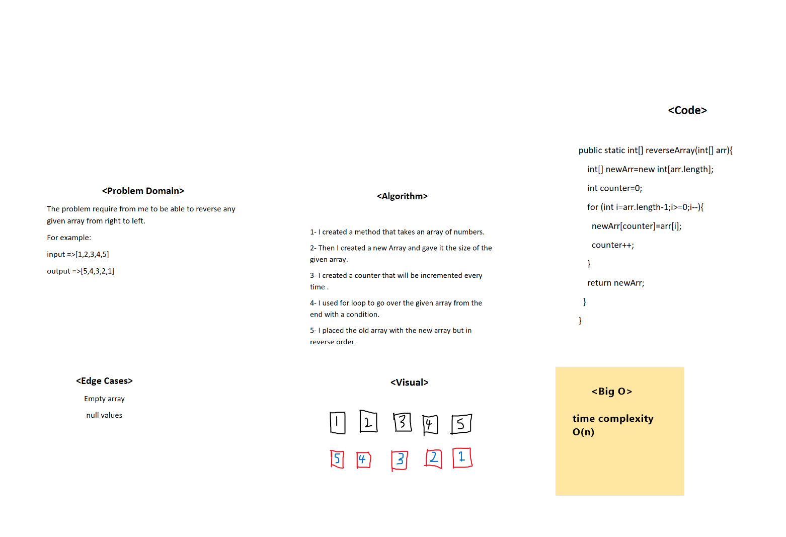

# Reverse an Array
It was about reversing any given array.

## Whiteboard Process
<!-- Embedded whiteboard image -->

## Approach & Efficiency
<!-- What approach did you take? Discuss Why. What is the Big O space/time for this approach? -->
first, I planned the problem domain and visualized the problem then started coding at last.
