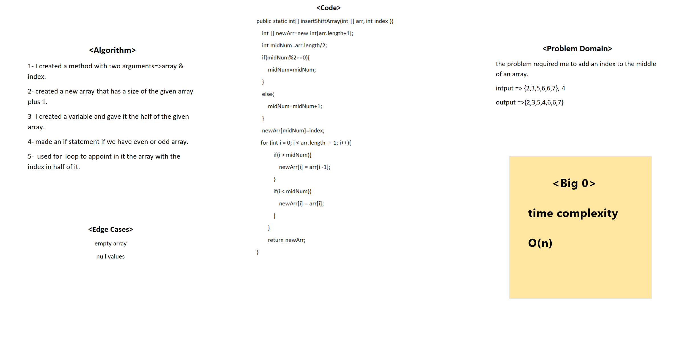

# Insert to Middle of an Array
It was about adding an index in the middle of an array.

## Whiteboard Process
<!-- Embedded whiteboard image -->

## Approach & Efficiency
<!-- What approach did you take? Discuss Why. What is the Big O space/time for this approach? -->
I planned how I am going to build code by using the problem domain and then I started coding.
