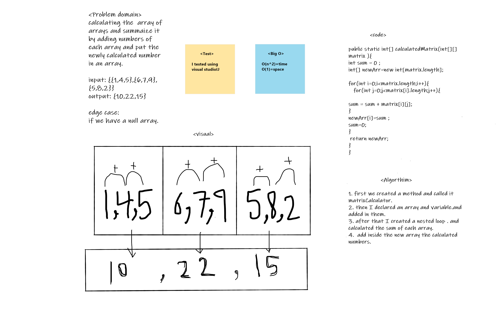

# Mock-Interviews
It is about calculating a matrix and adding the result of calculation inside it the new array. 

## Whiteboard Process
<!-- Embedded whiteboard image -->

## Approach & Efficiency
<!-- What approach did you take? Discuss Why. What is the Big O space/time for this approach? -->

1. step through code and track values in a table.
2. verify big O of written code.
3. verify code matches algorithm.
4. Explain testing according to inputs and outputs.

