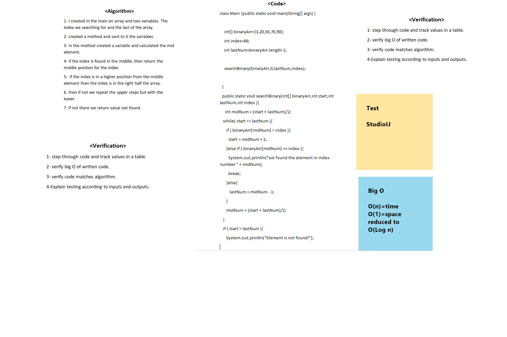

# Binary Search of Sorted Array
It was about doing a search upon a specific number from an array using the search binary.

## Whiteboard Process

## Approach & Efficiency
1. step through code and track values in a table.
2. verify big O of written code.
3. verify code matches algorithm.
4. Explain testing according to inputs and outputs.
